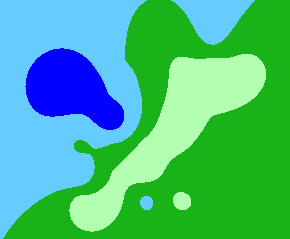

### 由 [kriging.js](https://github.com/oeo4b/kriging.js) 改造而来，使用webgl加速生成



[watch example](https://dengcheke.github.io/kriging-webgl)

#### 通常在cpu中逐像素计算
```javascript
import kriging from 'kriging.js';
const variogram = kriging.train(...);
for(let i=0;i<row;i++){
    for(let j=0;j<col;j++){
        const [x, y] = getPosition(j, i); //像素转世界坐标
        const value =  kriging.predict(x, y, variogram); //计算值
        pixel[ y * col + x] = getColor(value); //为像素着色
    }
}
```

#### 使用webgl加速计算以下部分:
```javascript
for(let i=0;i<row;i++){
    for(let j=0;j<col;j++){
        const value = kriging.predict(x, y, variogram); 
    }
}
```


### API
```typescript
//训练, 同 oeo4b/kriging.js
export function train(t: number[], x: number[], y: number[], model: KrigingModel, sigma2: number, alpha: number)


// 生成
// 色调映射
type ColorMappingItem = { 
    min: number, //最小值
    max: number, //最大值
    color: string //区间颜色
};
type P = {
    variogram: Variogram | VariogramObject; //训练参数结果
    llCorner: number[]; //要生成区域的左下角 [xmin, ymin]（世界坐标）
    gridSize: number[]; //要生成的网格尺寸 [width, height] （像素）
    cellSize: number; //每个网格的大小（世界坐标）
}
type Cancelable<R> = Promise<R> & { cancel: () => void };
//输出所有像素的预测值
export function gernerate_WEBGL(opts: P & { outputFormat: 'value-buffer' }): Cancelable<Float32Array>; 
//输出所有像素的预测值， 以rgb打包方式存储在imagebitmap中
export function gernerate_WEBGL(opts: P & { outputFormat: 'packed-imagebitmap', packValueRange: number[] }): Cancelable<ImageBitmap>; 
//直接输出imagebitmap图像
export function gernerate_WEBGL(opts: P & { outputFormat: 'imagebitmap', colorMapping: ColorMappingItem[] | ColorMappingObject }): Cancelable<ImageBitmap>;
```

### Example

#### outputFormat: 'imagebitmap'
```typescript
import {train, gernerate_WEBGL} from 'kriging-webgl';
const variogram = train(...);
const gridSize = [300, 300];//生成300x300像素

//直接生成映射颜色后图像
const imagebitmap = await gernerate_WEBGL({
    outputFormat: 'imagebitmap',
    gridSize,
    ...,
    colorMapping: [
        { min: 0, max: 10, color: "rgba(166, 255, 176, 1)", },
        { min: 10, max: 25, color: "rgba(30, 186, 37, 1)", },
        { min: 25, max: 50, color: "rgba(95, 207, 255, 1)", },
        { min: 50, max: 100, color: "rgba(0, 0, 255, 1)", },
        { min: 100, max: 250, color: "rgba(249, 0, 241, 1)", },
        { min: 250, max: Infinity, color: "rgba(255, 0, 0, 1)", },
    ]
});

//渲染 或 作为 webgl的纹理
const canvas = document.createElement('canvas');
canvas.width = gridSize[0];
canvas.height = gridSize[1];
const ctx = canvas.getContext('2d');
ctx.drawImage(imagebitmap, 0, 0);
```


#### outputFormat: 'value-buffer'
```typescript
import {train, gernerate_WEBGL } from 'kriging-webgl';
const variogram = train(...);
const gridSize = [300, 300];//生成300x300像素

//生成每个像素位置的预测值数组，需要手动映射颜色
const values = await gernerate_WEBGL({
    outputFormat: 'value-buffer',
    gridSize
});

// 1.cpu逐像素着色
const canvas = document.createElement('canvas');
canvas.width = gridSize[0];
canvas.height = gridSize[1];
const ctx = canvas.getContext('2d');
const imageData = ctx.createImageData();
for(let i=0; i < gridSize[1]; i++){
    for(let j=0; j < gridSize[0]; j++){
        const valueIndex = i * gridSize[0] + j;
        const value = values[valueIndex];
        const [r, g, b, a] = getColor(value);
        const pixel = valueIndex * 4;
        imageData.data[pixel] = r;
        imageData.data[pixel + 1] = g;
        imageData.data[pixel + 2] = b;
        imageData.data[pixel + 3] = a;
    }
}
ctx.putImageData(imageData, 0, 0);


// 2.webgl着色
const gl = canvas.getContext('webgl2');
//将数据做成浮点纹理
const texture = gl.createTexture();
gl.pixelStorei(gl.UNPACK_FLIP_Y_WEBGL, false);
gl.texParameteri(gl.TEXTURE_2D, gl.TEXTURE_MIN_FILTER, gl.NEAREST); //数据纹理, 不能直接插值
gl.texParameteri(gl.TEXTURE_2D, gl.TEXTURE_MAG_FILTER, gl.NEAREST); 
gl.texImage2D(gl.TEXTURE_2D, 0, gl.R32F, gridInfo[0], gridInfo[1], 0, gl.RED, gl.FLOAT, buffer);
//在shader中着色
` uniform sampler2D dataTexture;
  in vec2 v_uv;
  void main(){
     vec2 uv = vec2(v_uv.x, 1.0 - v_uv.y); // flipY is false, 所以手动翻转
    
     float value = texture(dataTexture, uv); //获取原始值
     gl_FragColor = getColor(value); //根据值获取输出颜色
  }
`
```


#### outputFormat: 'packed-imagebitmap'
```typescript
import {train, gernerate_WEBGL, glsl_pack} from 'kriging-webgl';
const xs = [...];
const ys = [...];
const datas = [1,2,3,4, ....];
const variogram = train(xs, ys, datas,...);
const gridSize = [300, 300];//生成300x300像素

//生成每个像素位置的预测值, 以rgb打包方式存储在imagebitmap中, 需要在shader中解包
const packedImagebitmap = await gernerate_WEBGL({
    outputFormat: 'packed-imagebitmap',
    gridSize,
    ...,
    packValueRange: [
        Math.min.apply(null, datas),
        Math.max.apply(null, datas)
    ], //打包的值范围，从原始值域或自行指定
});


//webgl 解包 并且 着色
const gl = canvas.getContext('webgl2');
//上传到纹理
const texture = gl.createTexture();
gl.texParameteri(gl.TEXTURE_2D, gl.TEXTURE_MIN_FILTER, gl.NEAREST); //数据纹理, 不能直接插值
gl.texParameteri(gl.TEXTURE_2D, gl.TEXTURE_MAG_FILTER, gl.NEAREST); 
gl.texImage2D(gl.TEXTURE_2D, 0, gl.RGBA, gl.RGBA, gl.UNSIGNED_BYTE, packedImageBitmap);
//fragment shader
` 
  uniform sampler2D packedImageBitmap;
  uniform vec2 unpackValueRange; //解码范围, 即原始打包的范围 [min, max]

  in vec2 v_uv;

  ${glsl_pack} //引入解包的代码

  void main(){
       vec2 uv = vec2(v_uv.x, 1.0 - v_uv.y); //注意y轴反向 gl.UNPACK_FLIP_Y_WEBGL 对 imagebitmap 无效

       vec3 packed_rgb = texture(packedImageBitmap, uv).rgb; //获取打包值

       float normalized_value = unpackRGBToNormalizeFloat(packed_rgb); //解包

       float value = mix(unpackValueRange.x, unpackValueRange.y, normalized_value); //映射回范围

       gl_FragColor = getColor(value); //输出颜色
  }
`
```

### Optimize 

#### 对象复用 VariogramObject & ColorMappingObject
```typescript
import {gernerate_WEBGL， createColorMappingObject， createVariogramObject} from 'kriging-webgl';


// 直接调用， 会在内部生成  VariogramObject / ColorMappingObject, 然后销毁
// 若需要多次生成或重新生成， 可以生成 VariogramObject / ColorMappingObject 重复使用, 提高性能
const result = await gernerate_WEBGL({
    variogram: variogram,
    colorMapping: colorMapping
});


// 给多个时刻不同数据使用相同的colorMapping
const colorMapping_object = createColorMappingObject([
    { min: 0, max: 10, color: "rgba(166, 255, 176, 1)", },
    { min: 10, max: 25, color: "rgba(30, 186, 37, 1)", },
    { min: 25, max: 50, color: "rgba(95, 207, 255, 1)", },
    { min: 50, max: 100, color: "rgba(0, 0, 255, 1)", },
    { min: 100, max: 250, color: "rgba(249, 0, 241, 1)", },
    { min: 250, max: Infinity, color: "rgba(255, 0, 0, 1)", },
]);

const variogram_1 = train(...);
const imagebitmap_1 = await gernerate_WEBGL({
    variogram: variogram_1,
    colorMapping: colorMapping_object
});
const variogram_2 = train(...);
const imagebitmap_2 = await gernerate_WEBGL({
    variogram: variogram_2,
    colorMapping: colorMapping_object
});

colorMapping_object.dispoe(); //不使用后, 需要手动释放


// 使用同一个数据， 生成不同的颜色映射的结果
const variogram = train(...);
const variogram_object = createVariogramObject(variogram);
const imagebitmap_1 = await gernerate_WEBGL({
    variogram: variogram_object,
    colorMapping: colorMapping_1
});
const imagebitmap_2 = await gernerate_WEBGL({
    variogram: variogram_object,
    colorMapping: colorMapping_2
});

variogram_object.dispoe(); //不使用后, 需要手动释放

```

#### 精度问题
某些低端设备不支持highp float; 坐标(例如web墨卡托)误差很大, 导致结果误差大; 可将坐标归一化，合理利用浮点数存储精度
```typescript
const xs = [113.13, 113.23, ....];
const ys = [23.33, 23.44, ...];

const [xmin, xmax, ymin, ymax] = resolveRange(xs, ys); 
const width = xmax - xmin;
const height = ymax - min;
const normalized_xs = xs.map(x => (x-xmin) / width);
const normalized_ys = ys.map(y => (y-ymin) / height);
const variogram = train(data, normalized_xs, normalized_ys, 'exponential', 0, 10);

const cellSize = width / 300;
const gridSize = [300, Math.round(height / cellSize)];
const imagebitmap = await gernerate_WEBGL({
    variogram,
    llCorner: [0, 0], //position normalized
    cellSize,
    gridSize,
});
```


### use in worker
```typescript
// main thread
const worker = new Worker('worker.js');
worker.onmessage = e => {
    doRender(e.data as ImageBitmap);
}
worker.postMessage({...});


// worker.js
import {train, gernerate_WEBGL} from 'kriging-webgl';
self.onmessage = e =>{
    const {data, xs, ys, ...} = e.data;
    const variogram = train(data, xs, ys,'exponential', 0, 10);
    gernerate_WEBGL({
        variogram,
        ....
    }).then(imagbitmap=>{
        self.postmessage({ imagbitmap }, [imagbitmap] /*transfer to main*/);
    })
}
```


